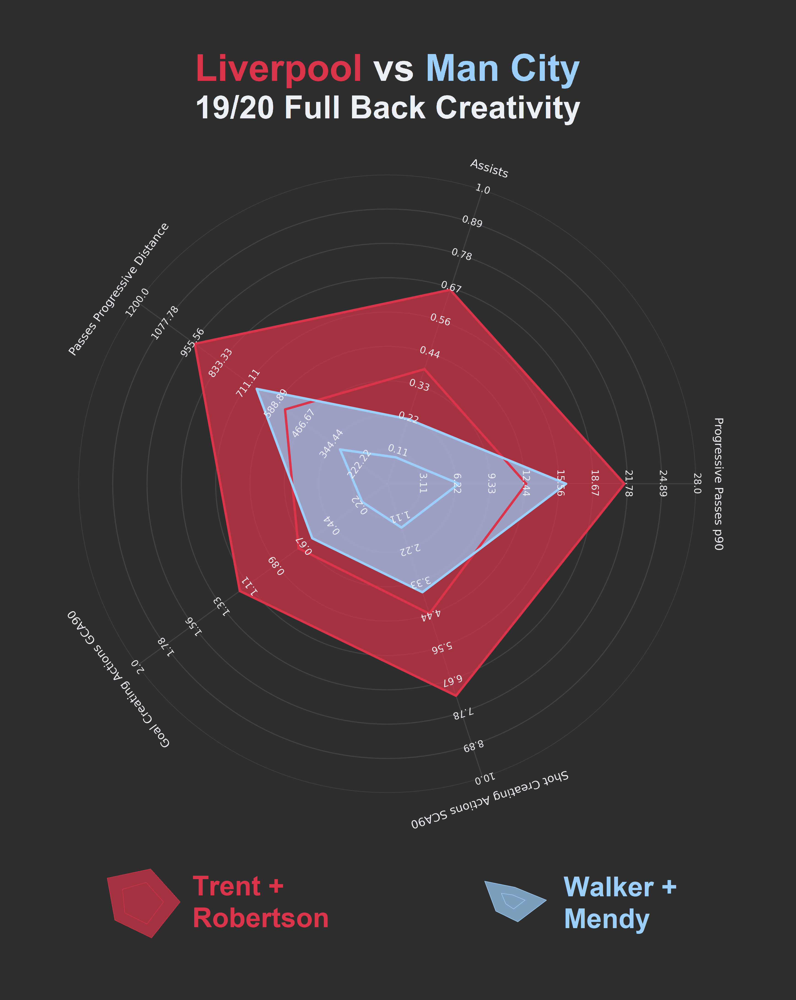

Less than 3 years ago, Jurgen Klopp fielded a back five that comprised Simon Mignolet, Dejan Lovren, Joël Matip, Alberto Moreno and non specialist Joe Gomez at right back on a premier league visit to Wembley. [The result on the day](https://twitter.com/guardian_sport/status/922180812770041858) seems like a very distant memory now.

**And despite we all knowing how Liverpool have fared since then, this is one more attempt at telling the story.**

As Mauricio Pochettino struggled to make a midfield pair out of Harry Winks and "failed signing" Moussa Sissoko, Liverpool went on to spend 75 million pounds to sign [a certain Dutch center half](https://www.bbc.com/sport/football/42496637).

A few months afterwards, Trent Alexander-Arnold showed his worth, nullifying Leroy Sane as Liverpool knocked Man City out of the champions league, and became the youngest liverpool player to ever start [a champions league final](https://twitter.com/Football__Tweet/status/1252504845464088577).

Andrew Roberton was meanwhile evolving slowly from an understudy to Alberto Moreno to the teams first choice left back and Karius' mistakes were enough to warrant a £66.9m investment in, now liverpool first choice goalkeeper, Alisson Becker.

## City's early stumbles given no chance for recovery

By GW15 this season, liverpool were already 11 points ahead of Man City. Then, followed a run of games where Alisson kept 10 clean sheets out of a possible 11 extending the gap to 18 points. **At that point**:

1. Man City had scored 6 goals more than Liverpool'd managed but conceded 14 more.
2. Liverpool had conceded SIXTEEN goals less than they had, just 2 seasons before.

Of course, Liverpool's defensive improvement is not a 19/20 phenomenon. In fact, they already conceded more this season with games still left to play, than they did in 18/19. But that run of 11 games remains very interesting for a number of reasons: It came on the back of a shaky defensive start by Liverpool, possibly because of Alisson's injury on the opening day.

More importantly, It also came late in the first half of the season and continued up until the 25th gameweek. It's the same run of gameswhere Liverpool lost their lead to city last season, A run where Liverpool dropped seven points with a loss at Manchester City in early January and two back to back draws against Leicester and West Ham 3 fixtures later.

19/20 tells a different story as Liverpool held on and kept that same period eventless. Competition was all but over. If city had any chance of recovering from their shaky start, Liverpool's defence had to be a lot worse than they have been.

## Flying fullbacks
Kevin De Bruyne leads the league in [Assists/90](https://www.dailymail.co.uk/sport/football/article-8505971/Its-Kevin-Bruyne-vs-Thierry-Henry-emerge-time-assist-king.html). He also leads the league in [xA](https://www.youtube.com/watch?v=H4kNa1cUvZM)/90, Goals+Assists/90  & Key Passes and is second in Goal Creating Actions/90 only to teammate Riyad Mahrez. It's only logical oppositions will look to shut down the Belgian and that Man City's gradual dependence on his creativity will ultimately hurt them. Easier said than done, though. Man City's gap to Liverpool can't, in any way, be accredited to a lack of creativity.

Liverpool, though, have bettered their rivals in playmaking diversity. They had a different source of creativity this season and two fullbacks who've edged their Man City counterparts by miles in terms of passing the ball.

Real Madrid's domestic and European success with a similar strategy under Zidane is a huge endorsement of an idea that only one of England's top two sides succeeded in replicating.

Carvajal and Marcelo managed 21 assists between them in all competitions under Zidane in 16/17 as they topped the league and thrashed Juventus in the Champions League final. This year, Robbo and Trent have created 23, while Mendy and Walker created 8.

TAA's passing output alone's been surpassing the sum of both of Man City's fullbacks, and Andrew Robertson's been himself an unsung playmaker, having just registered his 20th assist over 2 seasons against Brighton.

It's no surprise that Atletico Madrid posed a very strong challenge to liverpool in the champions league. Atletico madrid's two banks of four could on their day nullify any pair of wingbacks or fullbacks. They're one of very few teams to pose a challenge against a Real Madrid side on their day. Liverpool fans have been very vocal, though, about Adrian's contributions to their early exit, which takes us to the final piece of the jigsaw.

## The last wall standing that is Alisson Becker
Even if somehow you're able to get a good shot on target against liverpool (and [a look at the numbers](https://twitter.com/rogue_wee/status/1224662330820169728) say that's very difficult), You're still tasked with beating a very devastating Alisson Becker.

[Post Shot Expected Goals (PSxG)](https://statsbomb.com/2018/11/a-new-way-to-measure-keepers-shot-stopping-post-shot-expected-goals/) enables us to look at how much a keeper saves on a regular basis. There are three takeways here:

1. Alisson's higher amount of goals saved compared to Ederson (despite having played less) introduces another big difference between the two teams.
2. Those liverpool supporters are definitely right about Adrian. Adrian (1.03) concedes a significantly larger amount of goals than Alisson (0.66) allows per game. This ratio was almost 2:1 before City's recent thrashing of the reds. Adrian also has a lower saver percentage and almost half the Clean Sheet Ratio that Klopp has come to expect under Alisson.
3. Hugo Lloris is an absolute beast. His goals saved are now up to 9, leading the league despite missing out on most of the season before lockdown with injury. Tottenham's very shaky backline, of course, contributes to this very weird outlier.

**So goals saved and goals conceded have set City and Liverpool apart. Liverpool's playmaking fullbacks have set City and Liverpool apart. What next for both clubs?**

Nabi Keita or ['Nabi lad'](https://twitter.com/LFC/status/1252612555354312705) is yet to get a consistent spell of starting XI football. He's the one player in the squad who'd you expect the most improvement of. That along with the imminent signing of Thiago Alcantara promises a lot of choice for Liverpool's midfield which's arguably at times liverpool's weakest link. Keeping these two fit will be key to introducing more playmaking solutions from the side's midfield.

With playmakers such as KDB and the high hopes on Foden replacing David Silva, Guardiola may not necessarily want to recreate a Fullback pairing as strong as Liverpool's. What he'll surely be looking at is his side conceding almost a goal per game. Guardiola will have to look to bridge the gap between his side's defending and that of their Merseyside rivals.

<blockquote class="twitter-tweet">
Stan Collymore “If Pep thinks he doesn’t need to teach tackling or 1-on-1 combat in training then he’ll be going back to Spain with his tail between his legs”  Pep &quot;I don&#39;t train the tackles. What I want is to try to play good and score goals and arrive more, so what&#39;s tackles?&quot; <a href="https://t.co/BcjoXg307c">pic.twitter.com/BcjoXg307c</a>
&mdash; The Pep (@GuardiolaTweets) <a href="https://twitter.com/GuardiolaTweets/status/1128406265980497928?ref_src=twsrc%5Etfw">May 14, 2019</a></blockquote>

The 2020/2021 season will surely be unique across multiple dimensions, but is it time for Guardiola to start "training the tackles"?

----
Data is by [FBRef](https://fbref.com) and their partner [Statsbomb](https://statsbomb.com).

All plots are created with matplotlib and the code for this post & all future posts is available [here](https://github.com/Youssefares/statshousery/tree/master/notebooks) or by clicking the Open in Colab button under any article's title.

Thank you a lot for reading on. I am going to try to write about football analytics (not exclusively) more regularly again now. If you like what you see, [let me know on twitter](https://mobile.twitter.com/youssefares). See you soon!
